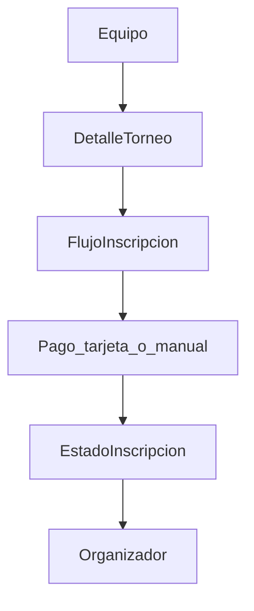

# RUBEN.MD — cuaderno de ideas (referencia)

**Propósito:** Guardar en un solo lugar el contexto, el benchmark y posibles direcciones para la app de **registro de torneos** y su **sitio web nuevo**. Esto es **material de reflexión y orden mental**, no una lista comprometida de lo que se va a construir ni un contrato de alcance.

**Enfoque:** Ir creando **paso a paso**. Lo que aparece abajo son **opciones e hipótesis** que se validan con el cliente y con cada iteración real del código.

---

## 1. Sitios: el tuyo vs referencia ajena

- **Tu web actual** es **[volleyschedule.com](https://www.volleyschedule.com/)** (“EVENTOS VOLLEYSCHEDULE”): vitrina con itinerarios (por ciudad u otros bloques), facilitadores, material visual y varios enlaces **REGISTRO …** que llevan al flujo de cada torneo. Es el **sitio vivo del negocio** desde donde estás arrancando.
- **[Volipr](https://www.volipr.com/)** es **otra compañía / otro sitio** que encontraste; sirve solo como **benchmark** (cómo muestran torneos, textos operativos, pagos, enlaces externos). **No es tu marca ni tu producto.**

### Decisión actual (sitio aparte)

- Objetivo: un **website nuevo**, **independiente** del que ya existe (este repo Next.js puede ser ese sitio, o la base técnica del mismo).
- **No tocar [volleyschedule.com](https://www.volleyschedule.com/)** por ahora: otra persona sigue usándolo; evitas conflictos de CMS, menús y enlaces viejos.
- Lo que hoy vive en volleyschedule (itinerarios, REGISTRO disperso, etc.) queda como **contexto histórico / paralelo**, no como algo que debas migrar en el arranque.
- **Integración futura** (por ejemplo subdominio o cambiar enlaces de REGISTRO) es **opcional** y solo cuando haya acuerdo; está bosquejada en [docs/VOLLEYSCHEDULE_INTEGRATION.md](docs/VOLLEYSCHEDULE_INTEGRATION.md) como una posibilidad, **no** como paso obligatorio del día uno.

---

## 2. Prioridad actual: administrador primero; website después; preview sin “lanzar” al público

- **Primero** la **app de administrador** (panel organizador: torneos, divisiones, inscripciones, estados, export, etc.). Es el núcleo operativo.
- El **website** (cara pública para equipos / marketing) **se conecta después** a la misma aplicación: mismo proyecto Next.js y misma capa de datos, solo otra cara o rutas públicas cuando toque.
- **No es la meta ahora** tener algo “live” como producto público masivo; sí poder **ver los cambios en vivo** y, cuando haga falta, **pasar un link** a alguien de confianza para que revise el avance.

### Formas típicas de ver el app sin abrirlo al mundo (referencia)

| Enfoque | Para qué sirve | Ojo |
|--------|----------------|-----|
| **Local** (`npm run dev`, `localhost`) | Iteración rápida; solo en tu PC (o LAN si configuras red). | Nadie fuera de tu red ve nada sin tunel. |
| **Túnel** (p. ej. Cloudflare Tunnel, ngrok) | URL HTTPS temporal que apunta a tu `localhost`. | Quien tenga el link puede entrar; usar datos de prueba, no producción sensible. |
| **Preview en Vercel** (por rama o commit) | URL estable por deploy para demos; ver [docs/DEPLOYMENT.md](docs/DEPLOYMENT.md). | En planes gratuitos el link puede ser “adivinable”; para más privacidad hay protección de deploy / contraseña según plan y configuración. |
| **Staging + protección** (middleware Basic Auth, o solo usuarios invitados con login) | Demo con URL fija pero no indexada ni anunciada. | Implica un poco de código o configuración cuando implementes. |

---

## 3. Qué es este repo (resumen)

- App web (Next.js) para **centralizar inscripciones** de torneos y dar cara pública al producto **sin depender** de editar volleyschedule.com. Hoy muchos clubs llegan por formularios dispersos (p. ej. Cognito) que en el pasado enlazaban desde [volleyschedule.com](https://www.volleyschedule.com/); el flujo nuevo puede vivir solo en el sitio nuevo.
- Idea central: un flujo y una base de datos compartida para equipos y organizadores (pagos, estados, export).

Detalle técnico y rutas mock viven en [README.md](README.md).

---

## 4. Documentación que ya existe en el repo (fuente de verdad técnica)

| Archivo | Para qué sirve |
|--------|----------------|
| [docs/DISCOVERY.md](docs/DISCOVERY.md) | Checklist con el organizador, campos inferidos, cobro, roster |
| [docs/STACK.md](docs/STACK.md) | Next.js, Supabase, Stripe, hosting |
| [docs/DATA_MODEL.md](docs/DATA_MODEL.md) | Entidades MVP, diagrama |
| [docs/WIREFRAMES.md](docs/WIREFRAMES.md) | Layout equipos vs admin |
| [docs/VOLLEYSCHEDULE_INTEGRATION.md](docs/VOLLEYSCHEDULE_INTEGRATION.md) | Subdominio, sustitución de enlaces legacy (**idea futura** si algún día enlazan ambos sitios) |
| [docs/DEPLOYMENT.md](docs/DEPLOYMENT.md) | Deploy Vercel / staging |

**Nota:** `RUBEN.MD` no sustituye esos archivos; solo resume y conecta ideas. La decisión de **sitio nuevo sin tocar volleyschedule.com** está anotada aquí por conveniencia operativa; cuando implementes algo, alinea `docs/` si cambia la estrategia de dominios o enlaces.

---

## 5. Estado del código hoy (recordatorio)

Prototipo navegable con datos mock (útil para UI y copy):

- `/` — landing  
- `/tournaments` — lista  
- `/tournaments/[slug]` — detalle  
- `/tournaments/[slug]/register` — placeholder del flujo  
- `/admin/registrations` — tabla + export CSV mock  

Implementación dispersa en `src/app/...` y `src/lib/mock-data.ts`.

---

## 6. Benchmark ajeno: [Volipr](https://www.volipr.com/) (qué hace “parecido”)

Observaciones a alto nivel (sitio tipo vitrina + herramientas externas):

- Lista de **eventos/torneos** con fechas y texto operativo (horarios, límites de pago, entrada, etc.).
- **Registro** vía enlaces externos (p. ej. Cognito Forms), no un solo producto unificado.
- Algunos torneos enlazan **calendario/resultados** en otro dominio (p. ej. `results.volipr.com`).
- **Pagos** muy visibles en la página (ATH Móvil Business, instrucciones en notas).
- **Descargas** (hojas de anotación, posiciones).

**Idea clave:** Volipr mezcla “marketing del evento” + formulario ajeno + pagos manuales documentados. Tu proyecto (desde **VolleySchedule**) apunta a **menos fragmentación** (un solo lugar para inscribir y seguir estado), pero puedes **tomar ideas de comunicación por torneo** (fechas límite, instrucciones de pago, enlaces a resultados) sin copiar su stack.

---

## 7. Posibles “huecos” respecto a esa experiencia (solo ideas)

Nada de esto obliga a implementarlo; sirve para cuando decidas el siguiente paso:

1. **Detalle de torneo más explícito:** deadline de pago, cuándo salen horarios, entrada al público, texto de ATH/transferencia.
2. **Registro real:** pasar de pantalla demo a formulario/wizard guardado en base de datos.
3. **Pagos mixtos:** tarjeta (Stripe) + referencia manual con revisión en admin (alineado con realidad en PR).
4. **Enlace opcional a resultados/calendario** externo por torneo.
5. **Sección de descargas** (plantillas PDF u hojas útiles).

---

## 8. Fases como *mapa mental* (no compromiso de tiempo ni de alcance)

Están aquí solo para ordenar prioridades cuando toque; los tiempos del plan anterior en Cursor eran orientativos y **no aplican** como promesa.

**Preferencia reciente:** tirar primero por trabajo de **admin / operación** (panel, datos, estados); la **vitrina pública** del website puede moverse después en la lista cuando el admin ya demuestre valor.

**Bloque A — Claridad pública por torneo**

- Campos o contenido en detalle del torneo: límites, instrucciones de pago, enlaces externos (resultados).
- Mejor copy en landing/lista si hace falta.

**Bloque B — Inscripción que persista**

- Auth + guardar equipo/registro en Supabase según [DATA_MODEL](docs/DATA_MODEL.md).
- Estados de registro visibles para equipo y admin.

**Bloque C — Pagos y operación**

- Stripe donde aplique; flujo manual + conciliación en panel organizador.
- Export CSV real desde datos vivos.

**Bloque D — “Nice to have” / diferenciación**

- Cupos en tiempo real, lista de espera, notificaciones, tracking público por equipo, descargas, i18n, etc.

---

## 9. Diagrama de flujo (concepto general)

---

## 10. Recordatorios para la conversación con el organizador

Sacado de [DISCOVERY.md](docs/DISCOVERY.md): export de muestra, campos obligatorios, método de cobro, quién aprueba roster, cupos, comunicación (email/WhatsApp), idioma, multi-equipo por club. Validar siempre con datos reales antes de modelar.

---

## 11. Qué hacer con este archivo después

- Actualizar **solo cuando quieras** anotar decisiones, nuevos benchmarks o “siguiente micro-paso”.
- Cuando ejecutes una feature concreta, el detalle suele vivir mejor en PR/commits y en `docs/` si cambia el modelo o el deploy.

---

*Última nota: admin primero; website público después; preview sin lanzamiento masivo; sitio nuevo aparte; volleyschedule.com sin tocar por ahora; Volipr = referencia ajena.*
