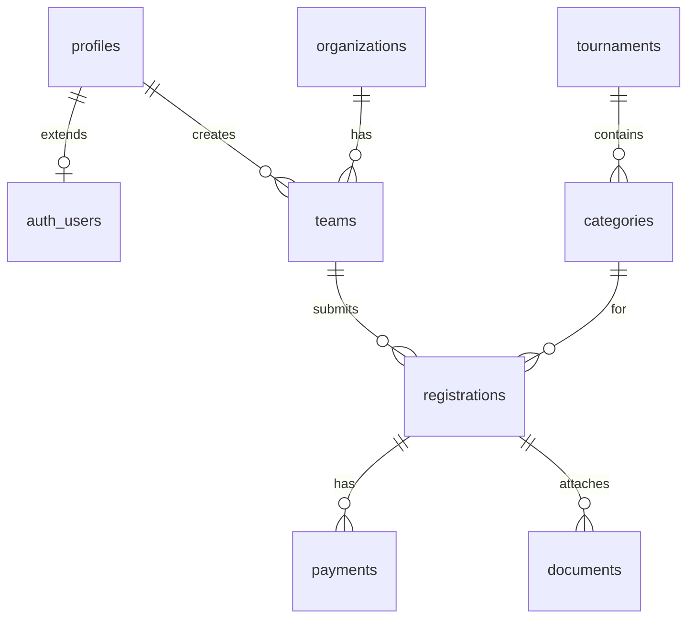

# Modelo de datos MVP

Esquema relacional en **PostgreSQL** (Supabase). Implementación SQL: [`supabase/migrations/001_initial_schema.sql`](../supabase/migrations/001_initial_schema.sql).

## Entidades

### `profiles`

Extiende `auth.users` de Supabase: nombre visible y rol de aplicación.

- `id` → FK a `auth.users`
- `full_name`, `phone`
- `role`: `organizer` | `team_manager` (ampliar después con `staff`)

### `organizations`

Club o academia (opcional pero recomendado para historial).

### `tournaments`

Evento publicado en la app (reemplaza “un Cognito por torneo”).

- Slug único para URLs públicas: `/tournaments/{slug}`
- **Mock / UI actual:** `registration_deadline_on`, `tournament_starts_on`, `tournament_ends_on`, `registration_fee_cents` (base opcional), `public_entry_fee_cents`, `promo_image` (Storage en prod), `status` `draft | open | closed`
- **Supabase (SQL legacy):** la migración inicial usa `divisions`; al alinear con producción conviene modelar **categorías** con subdivisiones opcionales (ver abajo).

### `categories` (concepto en mock; tabla futura)

Agrupa equipos y cupos; puede tener **subdivisiones** opcionales (solo etiquetas en MVP UI).

- `fee_cents` nullable en categoría si hereda la tarifa base del torneo
- `max_teams` nullable por categoría

### `divisions` / subdivisiones

La migración [`001_initial_schema.sql`](../supabase/migrations/001_initial_schema.sql) define `divisions` como categoría simple. Una evolución natural es `categories` + `subdivisions` (o división anidada) sin cambiar el resto del flujo de `registrations`.

### `teams`

Equipo registrado por un manager.

### `registrations`

Inscripción de un **team** a una **categoría** (o división, según esquema SQL vigente).

- Estados: `draft` → `pending_payment` → `paid` → `under_review` → `approved` | `rejected` | `waitlisted`
- `stripe_checkout_session_id` opcional para trazabilidad

### `payments`

Registro de intentos y confirmaciones (Stripe u otros).

### `documents`

Metadatos de archivos en Storage (waiver, roster PDF).

## Roles (resumen)

| Rol | Acceso |
|-----|--------|
| `organizer` | CRUD torneos/categorías, ver todas las registrations, exportar |
| `team_manager` | CRUD propio team, crear registration en torneos abiertos, subir documentos |

## Row Level Security (siguiente paso)

Tras aplicar la migración en Supabase, habilitar RLS:

- Managers: solo filas donde `teams.created_by = auth.uid()`
- Organizers: políticas por `profiles.role = organizer`

Las políticas exactas se implementan en migración `002_rls.sql` cuando se conecte la app.

## Diagrama (conceptual)

